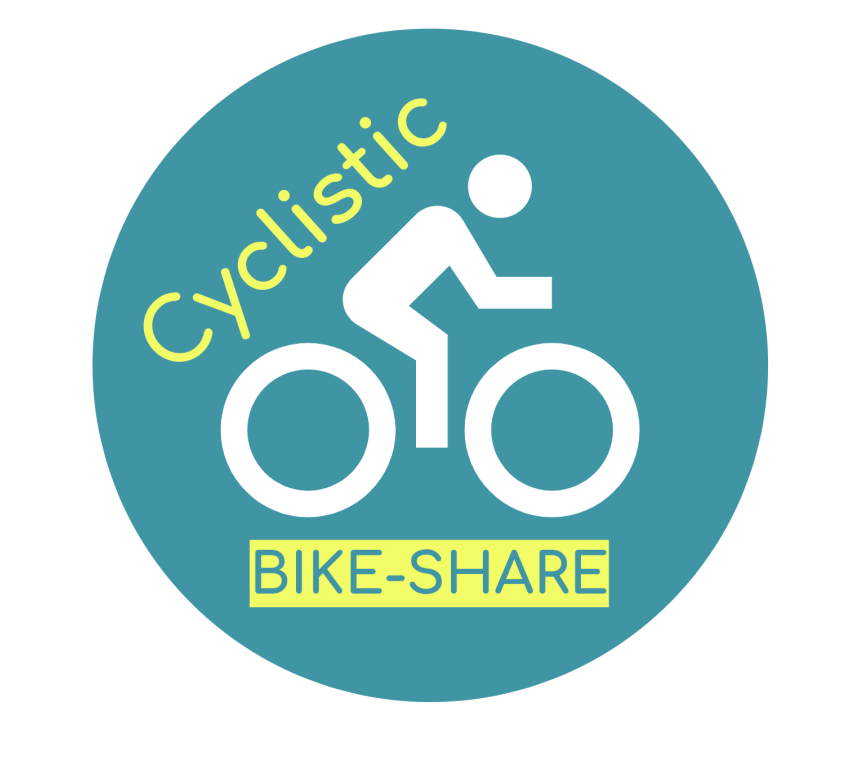
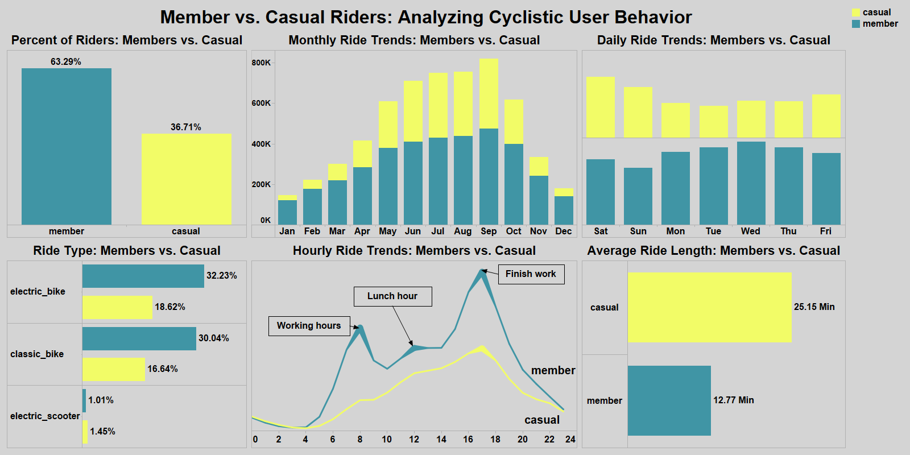
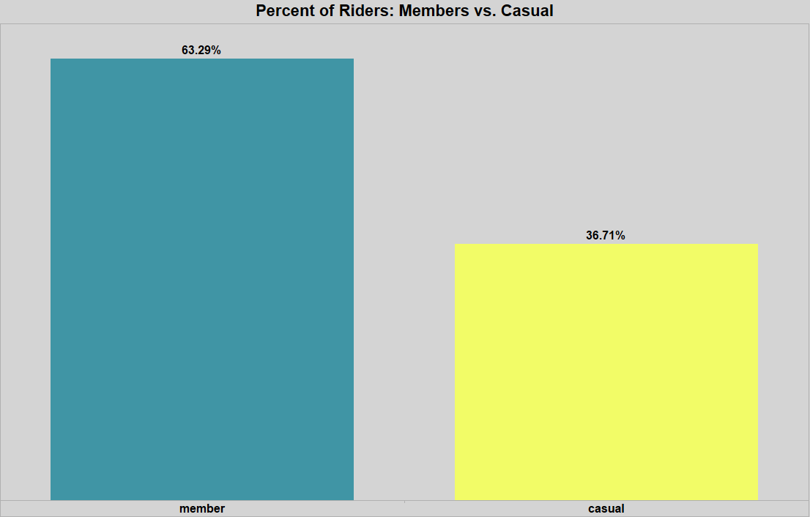
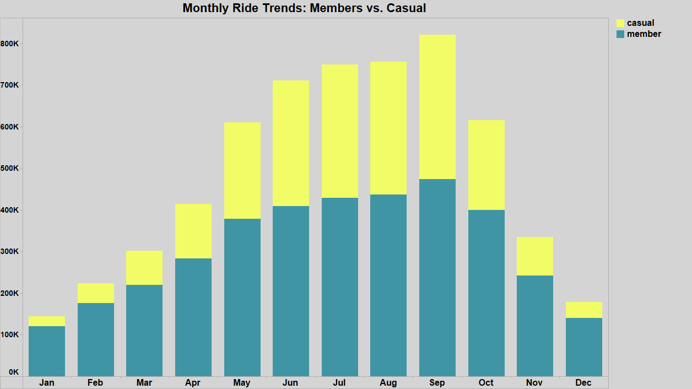
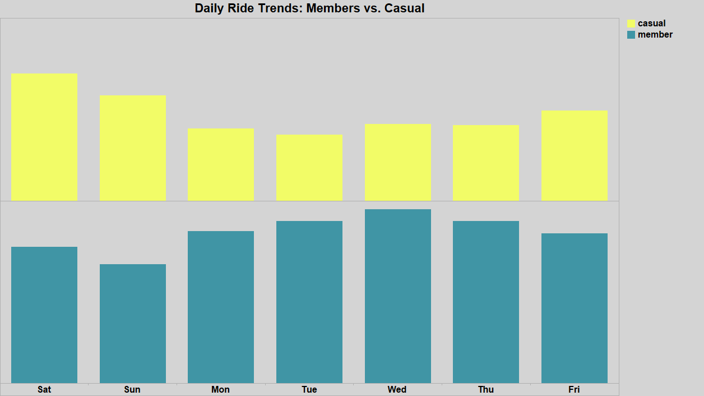
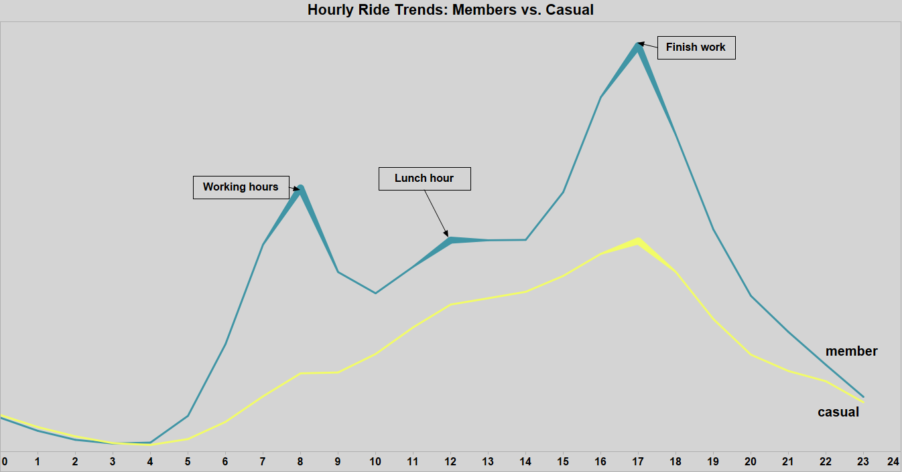
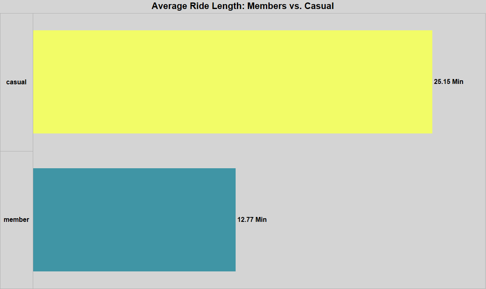
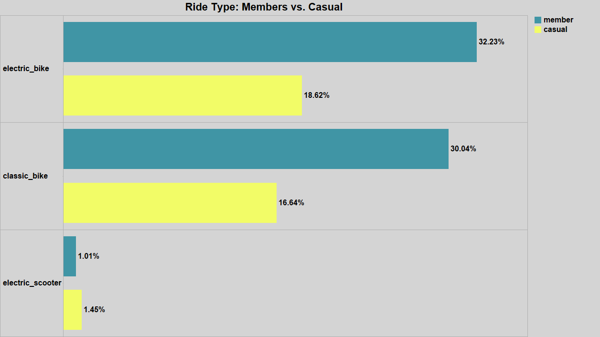

#  Cyclistic Bike-Share Analysis

## 📝Project Background
---
Cyclistic is a bike-share company operating in a metropolitan area, aiming to increase annual memberships by understanding user behavior. This analysis explores ride trends, identifies key differences between casual riders and members, and provides actionable recommendations to boost membership conversions.

Insights and recommendations are provided on the following key Comparisons Casual Riders vs. Annual Members:

   📌 Total Count of Riders: Analyzed the proportion of casual vs. member riders.
   
   📌 Monthly Trends: Identified seasonal patterns in ridership across the year.
   
   📌 Preferred Days & Times: Determined peak usage times for each rider type.
   
   📌 Ride Length: Compared average trip durations for casual and member riders.
   
   📌 Ride Type: Examined the most commonly used bike types by each group.

The SQL queries used to inspect and clean the data for this analysis can be found [here](Cleandata.txt).

Targeted SQL queries regarding various business questions can be found [here](Analyisdata.txt).

An interactive Tableau dashboard used to report and explore ride trends can be found [here](Dashboard.png).

## 🗄️Data Structure
---
Downloaded 12 months of ride data from Divvy Trip Data, with each month's data stored in separate files from the Cyclistic bike-share system.
All CSV files share the same structure. The SQL queries that were used to merge these files into a single table can be found [here](Combinefiles.txt).

| Column Name          | Data Type       |
|----------------------|----------------|
| ride_id             | VARCHAR(255)    |
| rideable_type       | VARCHAR(50)     |
| start_time         | DATETIME        |
| end_time           | DATETIME        |
| start_station_name | VARCHAR(255)    |
| start_station_id   | VARCHAR(50)     |
| end_station_name   | VARCHAR(255)    |
| end_station_id     | VARCHAR(50)     |
| start_lat         | FLOAT           |
| start_lng         | FLOAT           |
| end_lat           | FLOAT           |
| end_lng           | FLOAT           |
| member_casual     | VARCHAR(50)     |

## 🔑Executive Summary
---
Overview of Findings
The analysis reveals that casual ridership is highly seasonal, with a significant increase in warmer months, whereas members ride consistently throughout the year. Peak usage times differ, with casual riders being more active on weekends and members using the service primarily during weekday commute hours. Ride length also varies, as casual riders tend to take significantly longer trips than members, indicating a more recreational usage pattern. Additionally, electric bikes are slightly more popular than classic bikes among both groups, and there is potential to promote electric scooters, as casual riders show a small but notable interest in them. These insights can help shape marketing strategies, fleet distribution, and pricing models to optimize engagement and revenue.

## 📊Insights Deep Dive
---
1. **Total Count of Riders:**
    - Casual riders account for approximately 40% of total rides, while members contribute 60% of all trips.
      Analysis: Despite fewer casual riders, they make up a significant portion of overall usage, highlighting a key opportunity for membership growth.
    

    

2. **Monthly Trends:**
    - The busiest months are May to September, Casual ridership experiences a significant increase, while member usage also rises but at a more moderate pace.
    - Members and Casuals ridership decline sharply in winter (December-February), dropping by more than double compared to peak summer months.
    - Promotions or discounts in colder months could help stabilize ridership.
   

    

      
3. **Preferred Days & Times:**
    - Casual riders are most active on weekends, with a noticeable rise in rides on both Saturday and Sunday.
    - Members primarily ride on weekdays during peak commuting hours (7 AM – 9 AM & 5 PM – 7 PM).
    - Afternoon rides (12 PM – 5 PM) are the most popular time for casual users, suggesting recreational use.
    - Rides for both casual riders and members decline after 5 PM.

    
    

4. **Ride Length:**
    - Casual riders take significantly longer rides, averaging 25 minutes, compared to 12 minutes for members.
    - Casual users take more exploratory rides, while members use bikes for short-distance commutes.
    - The difference in ride length suggests that casual riders could be incentivized with time-based promotions.
   

    

6. **Ride Type:**
    - Both members and casual riders prefer electric bikes, but the difference in usage between electric and classic bikes is minimal, with only a slight gap of around 2%.
    - Electric scooters account for only about 1% of total rides for both members and casual riders, with casual users having a slightly higher usage than members.
    - The demand for electric bikes has grown steadily among members, suggesting a need for fleet expansion.
    - Although the preference gap between electric and classic bikes is small, casual riders show a slight preference for electric scooters, indicating growth potential.               Targeted promotions, increased availability, and strategic placement could boost usage.
   

    

## 💡Recommendations
---
Based on the insights and findings above, we recommend that the Cyclistic Marketing Team consider the following actions to increase membership conversions and optimize bike usage:

1. **Observation:** Casual riders take significantly longer trips, especially on weekends, compared to members.  
   **Recommendation:** Introduce time-based discounts or membership perks for longer rides to incentivize casual users to subscribe.

2. **Observation:** Casual ridership spikes during summer months (June – September) but declines sharply in winter.  
   **Recommendation:** Implement seasonal promotions during colder months, such as discounted winter memberships or bundled ride packages, to maintain engagement year-round.

3. **Observation:** While both members and casual riders use electric and classic bikes at similar rates, casual riders show a slight preference for electric scooters.  
   **Recommendation:** Promote electric scooters through targeted discounts, increased availability, and strategic placement in high-traffic areas to encourage higher adoption,                         particularly among casual riders.

4. **Observation:** Casual riders frequent tourist-heavy stations and take more weekend rides, while members use bikes consistently for commuting.  
   **Recommendation:** Launch location-based advertising and weekend pass incentives near popular casual rider stations to drive conversions.

5. **Observation:** Peak riding times for casual users are afternoons and weekends, whereas members ride during morning and evening rush hours.  
   **Recommendation:** Develop targeted marketing campaigns for casual users on weekends and afternoons, highlighting membership benefits such as priority access and discounted rates.

6. **Observation:** Further analysis is needed to identify key stations preferred by casual riders versus members and to assess any seasonal variations in station usage.
   **Recommendation:** Complete missing station data to improve analysis accuracy. Conduct a detailed study to pinpoint high-traffic stations for each group. Leverage this data to implement location-based advertising and introduce weekend pass incentives near popular casual rider stations, encouraging higher engagement and conversions.

## ⚠️Assumptions and Caveats
---
Throughout this analysis, multiple assumptions were made to address data challenges and ensure consistency. The following assumptions and limitations should be considered:

   - Missing Station Names: A significant number of rides had null values for both start station name and end station name. These records were removed from the analysis, as their inclusion could skew station-level insights.
   - Missing Latitude and Longitude Data: Many trips were missing geospatial coordinates (latitude and longitude) for start and end stations. These records were dropped, limiting the ability to conduct a full geospatial analysis.
   - Lack of User Demographics: The dataset does not contain age, gender, or other demographic details, limiting the ability to conduct targeted user segmentation analysis.

### Impact of These Assumptions

   - Station-level analysis is incomplete due to missing geospatial data.
   - Geospatial insights are limited to stations with valid latitude/longitude information.
   - Marketing and user behavior insights are constrained due to the lack of user demographics (e.g., age, gender, and income level). This prevents deeper segmentation and a          better understanding of different rider groups.

  

